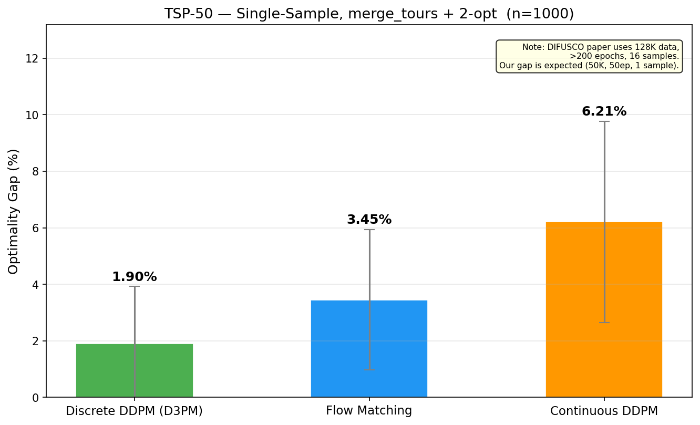
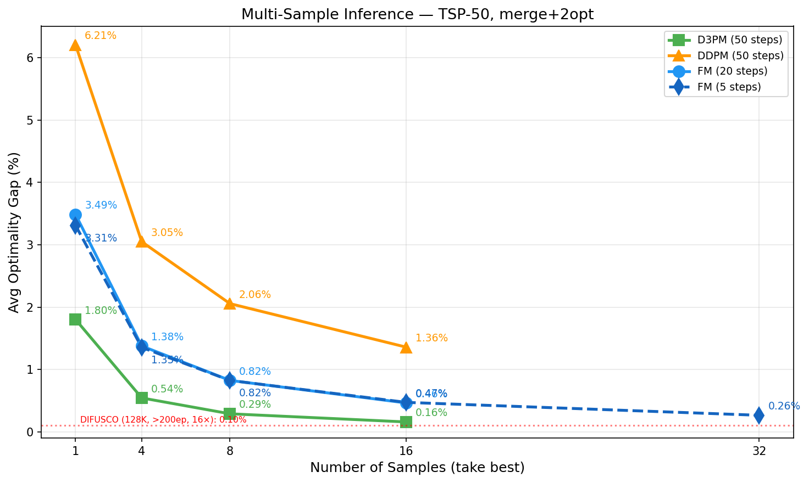
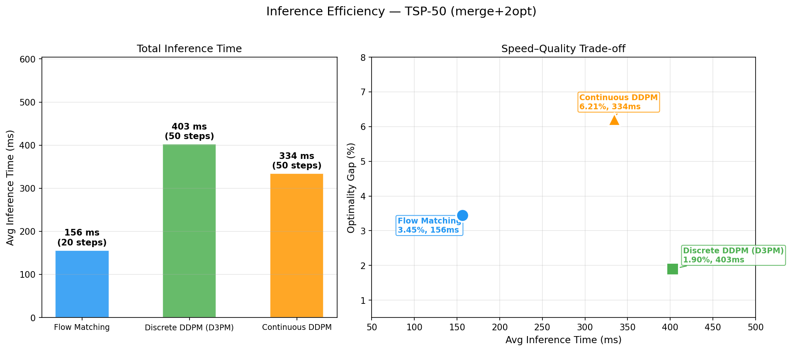
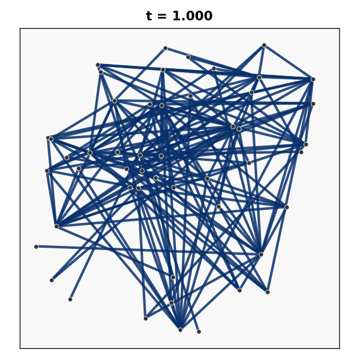
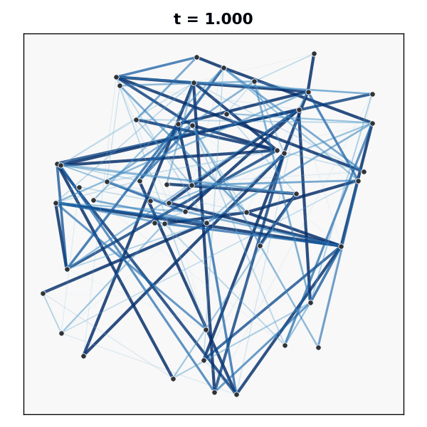
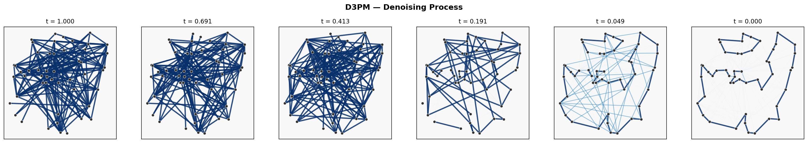
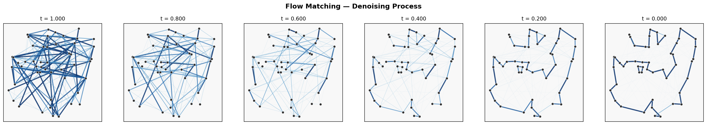
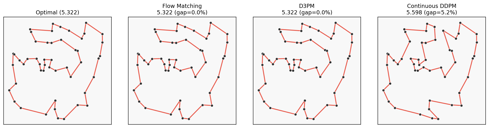

# TSP Diffusion: Flow Matching vs DDPM

Comparing three diffusion-based solvers for the **Travelling Salesman Problem (TSP-50)** — Discrete DDPM (D3PM), Continuous DDPM, and Flow Matching — trained from scratch with a GatedGCN encoder on 50K instances.

Reference architecture: [DIFUSCO (NeurIPS 2023)](https://github.com/Edward-Sun/DIFUSCO).

---

## Results

### Single Sample — `merge_tours + 2-opt`, n=1000 test instances



| Method | Optimality Gap ↓ | Inference Time |
|---|---|---|
| **Discrete DDPM (D3PM)** | **1.90%** | 403 ms (50 steps) |
| Flow Matching | 3.45% | 156 ms (20 steps) |
| Continuous DDPM | 6.21% | 334 ms (50 steps) |

### Multi-Sample — best-of-N, `merge_tours + 2-opt`

Taking the best tour across N independent samples dramatically closes the gap. FM with only 5 inference steps and 32 samples achieves **0.26%** — competitive with D3PM at 16×.



| Method | Samples | Gap ↓ | Total Time |
|---|---|---|---|
| **D3PM (50 steps)** | **16×** | **0.16%** | 5.3 s |
| FM (5 steps) | 32× | 0.26% | 8.5 s |
| FM (20 steps) | 16× | 0.46% | 5.6 s |
| Continuous DDPM (50 steps) | 16× | 1.36% | 10.8 s |

> **Key finding:** FM's much shorter inference (5 steps vs 50) lets you run 2× more samples in the same wall-clock budget — making it competitive with D3PM despite worse single-sample quality.

### Speed–Quality Trade-off



---

## Diffusion Process Visualizations

The GIFs below show the edge-probability heatmap evolving across inference steps (each frame = one denoising step). Brighter edges = higher probability of being in the tour.

### Discrete DDPM (D3PM) — 50 steps



### Flow Matching — 20 steps



### Continuous DDPM — 50 steps


### Heatmap Evolution (D3PM)



### Heatmap Evolution (Flow Matching)



### Decoded Tour vs Optimal



---

## Architecture

- **Encoder:** GatedGCN (12 layers, hidden_dim=256). Ablation variants: GAT, SimpleGCN.
- **Diffusion modes:**
  - `discrete_ddpm` — D3PM with absorbing-state transitions on {0,1} edge labels
  - `continuous_ddpm` — Gaussian DDPM with stochastic posterior sampling (DDPM, not DDIM)
  - `flow_matching` — ODE-based flow matching on {−1, +1} scaled edge predictions
- **Decoder:** `merge_tours` (DIFUSCO-style Hamiltonian merge) + `2-opt` local search
- **Training:** AdamW lr=2e-4, cosine decay, EMA decay=0.999, 50 epochs, RTX 4090
- **Data:** TSP-50, 50K train / 1K test

---

## Setup

```bash
pip install -r requirements.txt
```

Requires Python ≥ 3.9, PyTorch ≥ 2.0, PyTorch Geometric.

---

## Data

Pre-generated data is included in `data/`. To regenerate:

```bash
python data/generate_tsp_data.py --n 50 --num_samples 50000 --split train
python data/generate_tsp_data.py --n 50 --num_samples 1000  --split test
```

---

## Training

Checkpoints are saved automatically to `checkpoints/<mode>_<encoder_type>/` (e.g. `checkpoints/discrete_ddpm_gated_gcn/`). Best validation checkpoint is `best.pt`.

```bash
# Discrete DDPM (D3PM)
python train.py --mode discrete_ddpm --data_file data/tsp50_train.txt

# Flow Matching
python train.py --mode flow_matching --data_file data/tsp50_train.txt

# Continuous DDPM
python train.py --mode continuous_ddpm --data_file data/tsp50_train.txt
```

Key training options:

| Flag | Default | Description |
|------|---------|-------------|
| `--mode` | `flow_matching` | `discrete_ddpm` / `continuous_ddpm` / `flow_matching` |
| `--data_file` | `data/tsp20_train.txt` | Path to training data |
| `--epochs` | `50` | Number of training epochs |
| `--batch_size` | `64` | Batch size (use 32 for TSP-100) |
| `--hidden_dim` | `256` | GNN hidden dimension |
| `--n_layers` | `12` | Number of GNN layers |
| `--encoder_type` | `gated_gcn` | `gated_gcn` / `gat` / `simple_gcn` |
| `--resume` | — | Path to checkpoint to resume from |

---

## Evaluation

Both `--checkpoint` and `--data_file` are required.

```bash
# D3PM — merge_tours + 2-opt (single sample)
python evaluate.py \
    --checkpoint checkpoints/discrete_ddpm_gated_gcn/best.pt \
    --data_file data/tsp50_test.txt \
    --decode merge --use_2opt

# Flow Matching — merge_tours + 2-opt (single sample)
python evaluate.py \
    --checkpoint checkpoints/flow_matching_gated_gcn/best.pt \
    --data_file data/tsp50_test.txt \
    --decode merge --use_2opt

# Continuous DDPM — merge_tours + 2-opt (single sample)
python evaluate.py \
    --checkpoint checkpoints/continuous_ddpm_gated_gcn/best.pt \
    --data_file data/tsp50_test.txt \
    --decode merge --use_2opt
```

Multi-sample inference (best-of-N):

```bash
python evaluate.py \
    --checkpoint checkpoints/discrete_ddpm_gated_gcn/best.pt \
    --data_file data/tsp50_test.txt \
    --decode merge --use_2opt \
    --n_samples 16
```

Key evaluation options:

| Flag | Default | Description |
|------|---------|-------------|
| `--checkpoint` | required | Path to `.pt` checkpoint |
| `--data_file` | required | Path to test data |
| `--decode` | `merge` | `greedy` / `beam` / `merge` |
| `--use_2opt` | off | Enable 2-opt post-processing |
| `--beam_k` | `5` | Beam width (only for `--decode beam`) |
| `--n_samples` | `1` | Number of samples; best tour is kept |
| `--inference_steps` | auto | Override default steps (FM=20, D3PM/DDPM=50) |
| `--save_result` | — | Save JSON result to this path |

---

## Visualization

Checkpoints are loaded from the default paths (`checkpoints/<mode>_gated_gcn/best.pt`). Use `--mode` to select one model; omit to run all three.

```bash
# GIF + heatmap evolution for all three models
python visualize_diffusion.py --data_file data/tsp50_test.txt

# One model only
python visualize_diffusion.py --mode discrete_ddpm --data_file data/tsp50_test.txt

# Choose which instance to visualize (0-indexed)
python visualize_diffusion.py --mode flow_matching --instance_idx 5

# Custom output directory
python visualize_diffusion.py --out_dir my_figs
```

Key visualization options:

| Flag | Default | Description |
|------|---------|-------------|
| `--mode` | all | `discrete_ddpm` / `continuous_ddpm` / `flow_matching` |
| `--data_file` | `data/tsp50_test.txt` | Test data file |
| `--instance_idx` | `0` | Which test instance to visualize |
| `--out_dir` | `report/figs` | Output directory for GIFs and figures |
| `--gif_steps` | auto | Override inference steps for GIF |
| `--n_samples` | `8` | Samples for best-of-N tour comparison figure |

Outputs written to `--out_dir`:
- `diffusion_{fm,d3pm,ddpm}.gif` — denoising animation
- `heatmap_evolution_{fm,d3pm,ddpm}.png` — 6-frame snapshot grid
- `tour_comparison.png` — model predictions vs optimal tours

---

## Repository Structure

```
.
├── train.py                      # Training loop (EMA, AdamW, cosine scheduler)
├── evaluate.py                   # Evaluation: gap computation, multi-sample
├── visualize_diffusion.py        # GIF generation, heatmap grids, tour plots
├── models/
│   ├── tsp_model.py              # TSPDiffusionModel — FM / D3PM / DDPM
│   ├── gnn_encoder.py            # GatedGCN / GAT / SimpleGCN encoder
│   ├── diffusion_schedulers.py   # FM, D3PM, Gaussian noise schedules
│   ├── tsp_dataset.py            # Dataset loader (DIFUSCO .txt format)
│   └── nn_utils.py               # GroupNorm32, timestep embedding
├── utils/
│   ├── tsp_utils.py              # TSPEvaluator, merge_tours, gap computation
│   ├── decode.py                 # Greedy, beam search, 2-opt
│   └── visualize.py              # Plotting helpers
├── data/
│   ├── generate_tsp_data.py      # Data generation (elkai / python-tsp)
│   └── tsp{20,50,100}_{train,test}.txt
└── assets/                       # Figures and GIFs used in this README
```
